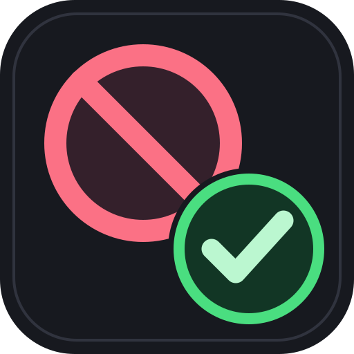

# Not Interested for Seanime



Keep track of anime you have already considered while browsing **Search** and **Discover**, including **Discover → Schedule**.

| Mark | Card appearance | With hiding enabled |
| --- | --- | --- |
| **Interested** | Green border and green **Interested** badge | Stays visible with its green markings |
| **Not interested** | Faded cover and red **Not interested** badge | Hidden |
| Unmarked | Normal Seanime appearance | Stays visible |

Marks and display settings are saved across Seanime restarts. They belong to the anime's AniList series ID, so alternate title spellings refer to the same mark. Each season or sequel with a different ID is marked separately.

## Install

Tested with **Seanime 3.10.3**. The plugin requires **Storage** permission to save your marks.

1. In Seanime, open **Extensions → Installed → Add extensions**.
2. Paste this manifest URL and install the plugin:

   ```text
   https://raw.githubusercontent.com/randoomdude/Seanime-Extension---Not-Interested/main/local-anime-not-interested.json
   ```

3. Approve **Not Interested**'s **Storage** permission when Seanime asks.
4. Open Search or Discover and right-click an anime card.

The manifest contains the complete plugin. Installing it does not require Node.js or the development tools below.

You can also download `local-anime-not-interested.json` from the [latest release](https://github.com/randoomdude/Seanime-Extension---Not-Interested/releases/latest), place it in your Seanime extensions folder, and restart Seanime. Keep the filename `local-anime-not-interested.json`. On Windows, use `%APPDATA%\Seanime\extensions` if Seanime uses that data folder, or the extensions folder in your configured data directory.

### Add this plugin's marketplace repository

To browse and install it as a marketplace card, open Seanime's **Marketplace → Add new repository** and use:

```text
https://raw.githubusercontent.com/randoomdude/Seanime-Extension---Not-Interested/main/marketplace.json
```

This index contains this plugin. It is a custom repository; inclusion in Seanime's default marketplace requires its maintainer's review.

## Use

- **Mark as interested:** adds a green card border and green **Interested** badge.
- **Mark not interested:** fades the card and adds a red **Not interested** badge.
- Choosing either state replaces the other state for that series. Both actions are available in the card's right-click menu and the anime page's menu.
- In **Discover → Schedule**, use the **✓ Interested** and **⊘ Not interested** buttons beneath a show's airing time. Existing marks automatically appear on every scheduled episode of that anime. The schedule's native right-click menu still provides Preview and Open page.
- Open **Tray Plugins → Not Interested** for display settings and your saved series.
- Turn on **Hide not interested series** to hide only negative marks. Interested series remain visible with their green border and badge.
- **Show marks** turns all visual effects on or off while keeping your saved choices.
- **Undo last change** reverses the most recent mark change in the current plugin session.
- Search the saved list by title or series ID. Use **Clear mark** to return a series to an unmarked state.

The effects apply to Search, Discover's anime cards, and Discover's airing Schedule. Interested schedule rows receive a green border and marker; negative rows fade or disappear when hiding is enabled. They do not change AniList watching/dropped status, manga cards, library cards, or downloaded files. The plugin itself makes no network requests.

## Update and preserve your marks

Use Seanime's **Check for updates** after installing from the manifest URL, or replace the extension JSON with the newest version and reload/restart Seanime. Version 1.1.0 preserves negative marks from the earlier local 1.0.0 plugin.

The plugin ID remains `local-anime-not-interested` so existing saved choices carry over. Update the existing plugin in place. **Disable** preserves its saved data; **Uninstall** deletes the plugin data through Seanime.

The extension JSON backs up the code, but your saved marks live in Seanime's database. Preserve your Seanime data folder/database when backing up your marks.

## Releases

[Download releases](https://github.com/randoomdude/Seanime-Extension---Not-Interested/releases) and read the [changelog](CHANGELOG.md).

Each release includes the self-contained extension JSON, JavaScript source, and PNG icon. A repository workflow publishes a release when a new version is pushed to `main`; it leaves existing releases unchanged.

## Development

`plugin.js` is the source. `scripts/build.cjs` embeds it into the installable JSON and creates the marketplace index using the version in `package.json`. `assets/icon.svg` is the editable icon source; its 512 × 512 PNG export is used by Seanime because extension cards reject SVG data URLs.

```sh
npm run build
npm run check
```

Browser tests exercise the real CSS against Seanime-shaped card fixtures, with simulated durable storage:

```sh
npm install
npx playwright install chromium
npm test
```

To use an already installed Chromium browser, set `SEANIME_TEST_BROWSER` to its executable path before running the tests. Tests cover both mark states, hiding without losing interested markers, lazy-grid placeholders, schedule rows and their buttons, duplicate episodes, rows loaded later, switching states, persistence across fresh runtimes, undo, failed saves, cleanup, and migration from the earlier saved format. They do not replace a visual check inside Seanime.

For a new release, update `package.json`, `CHANGELOG.md`, and `RELEASE_NOTES.md`; rebuild the JSON, run the checks, and push to `main`. The release workflow validates that the manifest matches the source before publishing. Changes to Seanime's card markup may require a plugin update.

### Schedule menu and permission

Right-click an entry in **Discover → Schedule** to mark a show Interested or Not interested. Selecting the same state twice clears the mark; choosing the opposite changes it. Each scheduled episode of the same AniList series shares that mark. The added `dom-script-manipulation` permission is used only to send an Escape key event when a Schedule mark is selected so the native menu closes and releases input. Seanime disables automatic updates for plugins with this unsafe flag, so future updates require manual installation. Keep the plugin ID and do not uninstall if you want to retain saved marks.
